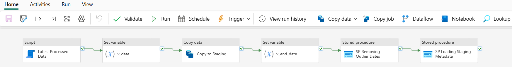

# Pipeline for Staging Layer

## Overall Pipeline



## Latest Processed Data

For the Script Activity “Latest Processed Data”, use below SQL code.

```sql
select top 1 
latest_processed_pickup 
from metadata.processing_log 
where table_processed = 'staging_nyctaxi_yellow'
order by latest_processed_pickup desc;
```

## Set variable: v_date

Pipeline expression for "Set Variable" activity to set "v_date"

```
@formatDateTime(addToTime(activity('Latest Processed Date').output.resultSets[0].rows[0].latest_processed_pickup, 1, 'Month'), 'yyyy-MM')
```

## Copy to Staging

Pre Copy Script

](../docs/screenshots/copytostagingprecopyscript.png)

## Set variable: v_end_date

Pipeline expression for "Set Variable" activity to set "v_end_date"

```
@addToTime(concat(variables('v_date'), '-01'),1,'Month')
```

## SP Removing Outlier Dates

For the Stored Procedure Activity “SP Removing Outlier Dates”.

Create the Stored Procedure `stg.data_cleaning_stg` in the Data Warehouse using the code below.

```sql
create procedure stg.data_cleaning_stg
@end_date datetime2,
@start_date datetime2
as
delete from stg.nyctaxi_yellow 
where tpep_pickup_datetime < @start_date or tpep_pickup_datetime > @end_date;
```

](../docs/screenshots/sp_data_cleaning_stg.png)

## SP Loading Staging Metadata

For the Stored Procedure Activity “SP Loading Staging Metadata”.

Code to create the metadata.processing_log table.

```sql
create schema metadata;

create table metadata.processing_log
(
	pipeline_run_id varchar(255), 
	table_processed varchar(255), 
	rows_processed INT, 
	latest_processed_pickup datetime2(6),
	processed_datetime datetime2(6)
);
```

Created the Stored Procedure `metadata.insert_staging_metadata` in the Data Warehouse using the code below.

```sql
CREATE PROCEDURE metadata.insert_staging_metadata
    @pipeline_run_id VARCHAR(255),
    @table_name VARCHAR(255),
    @processed_date DATETIME2
AS
    INSERT INTO metadata.processing_log (pipeline_run_id, table_processed, rows_processed, latest_processed_pickup, processed_datetime)
    SELECT
        @pipeline_run_id AS pipeline_id,
        @table_name AS table_processed,
        COUNT(*) AS rows_processed,
        MAX(tpep_pickup_datetime) AS latest_processed_pickup,
        @processed_date AS processed_datetime
    FROM stg.nyctaxi_yellow;
```

](../docs/screenshots/sp_processing_metadata.png)

